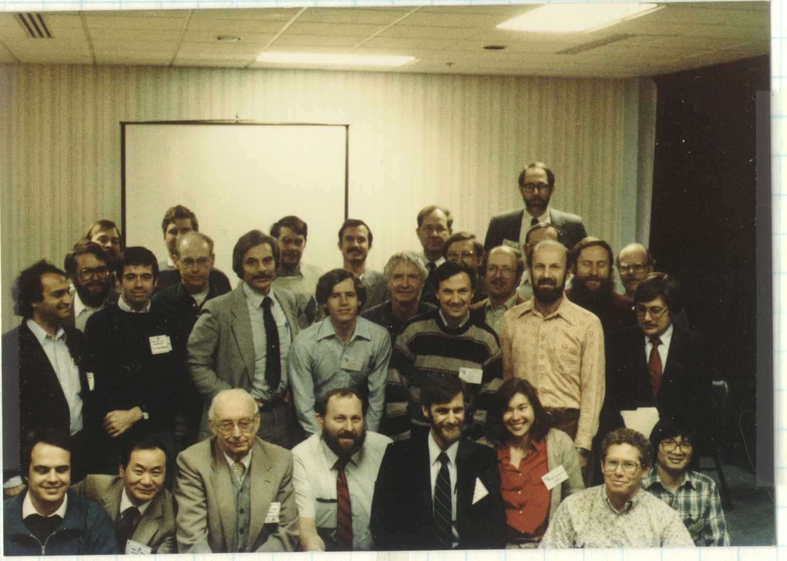

In January of 1985 approximately 50 scientists convened in Tuscon, Arizona to discuss the 1982-1984 eclipse of epsilon Auriage. Proceedings were subsequently published in [NASA conference proceedings 2384](http://adsabs.harvard.edu/abs/1985eea..book.....S).

Below is a photograph of the participants from the conference. Jeffrey Hopkins and Robert Stencel are in the middle of the front row.

<figure>
    
    <figcaption>1985 epsilon Aurigae workshop group photo.</figcaption>
</figure>

