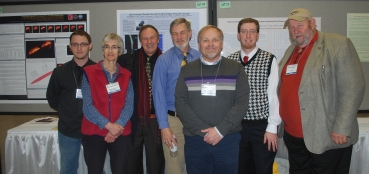
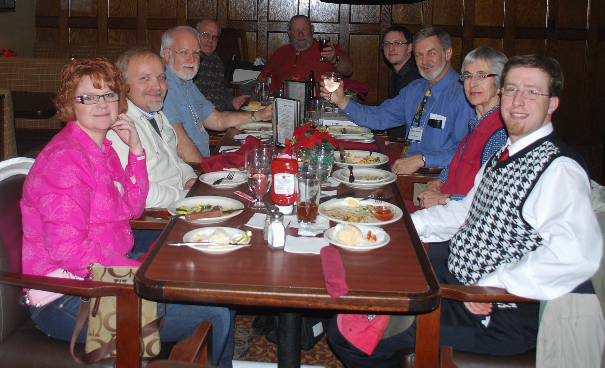

In Janurary 2010 at the AAS 217 meeting in Seattle, WA there was a dedicated special session and a long row of posters dedicated to epsilon Auriage.

Poster authors at the AAS 217 special session

<figure>
    
    <figcaption>Poster authors for the epsilon Aurigae special session. Authors
        present (left to right): John Clover, Elizabeth Griffin, Edward Guinan,
        Robert Stencel, Bill Ketzeback, Brian Kloppenborg, Jeffrey Hopkins.
    </figcaption>
</figure>

After the poster session several of us went out to dinner

<figure>
    
    <figcaption>2011 epsilon Aurigae image meeting dinner photo.
        Around the table, left to right: Bill Ketzelback and wife, Tom Ake,
        Greg Jones(?), Jeffrey Hopkins, Robert Stencel, Elizabeth Griffin, Brian Kloppenborg.
    </figcaption>
</figure>
